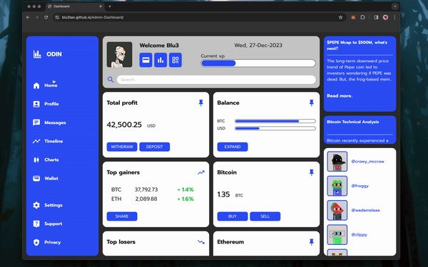

# Admin-Dashboard #

Fully responsive Admin dashboard built with CSS Grid system.
[Live demo](https://blu3tan.github.io/Admin-Dashboard/)

# Description #

My take on the dashboard, the responsiveness is achieved with media queries.
The entire layout is done with css grid, flex is used just to align stuff
here and there like text inside buttons etc.

# Concept #

The general concept was to always have the full dashboard in front so i made
the various sections (except for the 'side' and 'admin info') scrollable.
This way hypothetically you could have unlimited cards, news or trending profiles.

------------------------------------------------------------------------